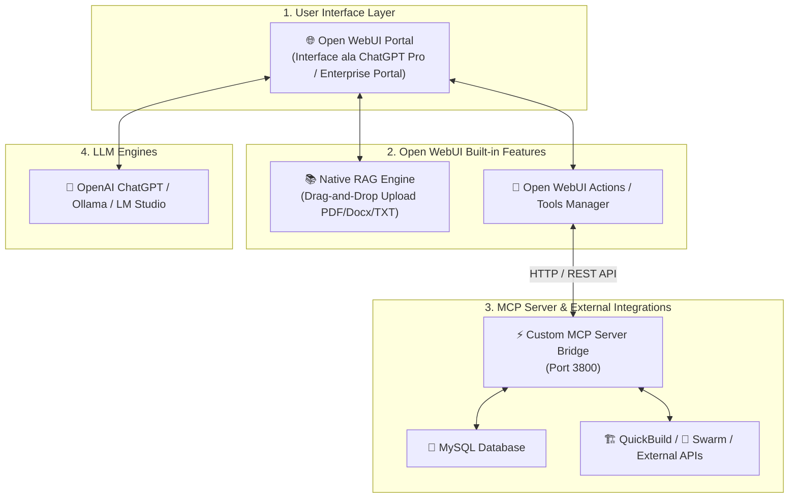

# 🌐 Panduan Integrasi Open WebUI + RAG + Custom MCP Server

Dokumen ini menjelaskan bagaimana **Open WebUI** dapat digunakan sebagai frontend & RAG Engine utama yang dihubungkan dengan **Custom MCP Server** yang telah kita bangun.

---

## 💡 Apakah Bisa Menggunakan Open WebUI?

**JAWABANNYA: SANGAT BISA DAN SANGAT DIREKOMENDASIKAN!** 🚀

Open WebUI (sebelumnya Ollama WebUI) adalah salah satu platform AI Web UI Open-Source paling kaya fitur yang memiliki **Built-in RAG Engine** dan **OpenAPI / MCP Tools Support** secara native.

---

## 📐 Arsitektur Integrasi Open WebUI + RAG + MCP



---

## 🚀 Keunggulan Menggunakan Open WebUI

1. **RAG Instan Tanpa Coding (Drag & Drop Dokumen)**:
   * Anda tinggal meng-upload file PDF, DOCX, TXT, atau URL di menu **Documents / Knowledge** pada Open WebUI.
   * Open WebUI secara otomatis memotong teks (*chunking*), membuat *embeddings*, dan menyimpannya di Vector DB bawaan.
2. **Fitur Antarmuka yang Sangat Lengkap (ChatGPT-like)**:
   * Multi-user management & Role-Based Access Control (Admin / User).
   * Web Search bawaan (SearXNG / Google / Bing).
   * Speech-to-text & Text-to-speech.
   * Chat History, Tagging, & Model Switcher (Ganti model OpenAI, Ollama, atau LM Studio secara instan).
3. **Dukungan Tools / MCP Extensions**:
   * Open WebUI mendukung pencatatan **Custom Tools** via Python / OpenAPI HTTP, sehingga MCP Server (seperti port `3800` yang kita buat) bisa langsung dipanggil oleh AI di dalam Open WebUI!

---

## ⚖️ Perbandingan: Open WebUI vs Custom Floating Chatbot Widget

| Kriteria | Open WebUI Portal | Custom Floating Widget (yang kita buat) |
| :--- | :--- | :--- |
| **Bentuk Tampilan** | Full Web Portal khusus (seperti ChatGPT web) | Widget Melayang di pojok kanan bawah Web App yang sudah ada |
| **RAG Dokumen** | 🟢 Native Built-in (Tinggal Upload PDF/Docx) | 🟡 Perlu setup Vector Store terpisah (ChromaDB/Qdrant) |
| **Kemudahan Install** | ⚡ Sangat Mudah (`docker run` / pip) | 🚀 Perlu menyalin script JS ke halaman web |
| **Interaksi Web App** | Terpisah sebagai portal tersendiri | Menyatu langsung dengan tombol/halaman aplikasi PHP XAMPP |
| **Penggunaan Ideal** | Internal Portal Perusahaan / Dashboard AI Tim | Asisten Asisten Melayang di dalam Web Sistem Kerja |

---

## 🛠️ Cara Menguji Open WebUI Tanpa Docker (Native Python/pip) & Dengan Docker

### 1. Cara Tanpa Docker (Native Python - Rekomendasi Mudah di Windows):
Persyaratan: **Python 3.11+** terinstal di Windows/Linux.

Buka **Command Prompt (CMD)** atau PowerShell:
```cmd
pip install open-webui
```
Jalankan server Open WebUI:
```cmd
open-webui serve
```
*(Open WebUI akan langsung berjalan native di `http://localhost:8080` tanpa memerlukan Docker sama sekali!)*

---

### 2. Cara Menggunakan Docker (Opsional):
```bash
docker run -d -p 3000:8080 -e OPENAI_API_BASE_URL=http://host.docker.internal:3800/v1 --add-host=host.docker.internal:host-gateway --name open-webui --restart always ghcr.io/open-webui/open-webui:main
```
Akses di browser: `http://localhost:3000`

---

## 🎯 Kesimpulan & Rekomendasi Solusi

1. **Gunakan Open WebUI** jika Anda ingin membuat **Portal AI Internal Tim/Perusahaan** yang siap pakai dengan RAG dokumen drag-and-drop instan.
2. **Gunakan Custom Floating Widget** jika Anda ingin chatbot **menyatu di dalam aplikasi PHP XAMPP** yang sedang dibuka pengguna tanpa perlu membuka tab/portal baru.
3. **Kombinasi Terbaik**: MCP Server yang telah kita bangun (`http://localhost:3800`) dapat melayani **KEDUA-DUANYA** sekaligus (bisa dipanggil oleh Open WebUI maupun oleh Floating Widget UI)! 🚀
