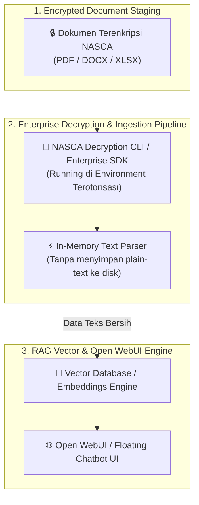

# 🔒 Panduan Penanganan Dokumen Enkripsi NASCA / Enterprise DRM pada Sistem RAG

Dokumen ini menjelaskan tantangan dan **4 Solusi Praktis** untuk meng-ingest dokumen yang terenkripsi oleh **NASCA / Enterprise DRM (Digital Rights Management)** ke dalam sistem RAG & Open WebUI.

---

## ⚠️ Mengapa RAG Engine Biasa Gagal Membaca Dokumen NASCA?

Sistem DRM Enterprise seperti **NASCA** menyandikan file (PDF, Office DOCX, XLSX) dengan enkripsi tingkat tinggi berbasis sertifikat/kredensial pengguna.

Jika file NASCA langsung di-upload ke RAG Parser standar (seperti PyPDF, LangChain PDFLoader, atau Open WebUI):
- Parser akan mengeluarkan error: `PdfReadError: File is encrypted`.
- Atau hasil ekstraksi teks berupa karakter acak (ciphertext garbled text).

---

## 📐 Arsitektur Solution Pipeline untuk Dokumen NASCA



---

## 🛠️ 4 Solusi Terbaik Mengatasi Dokumen NASCA pada RAG:

### Solusi 1: Pre-processing Decryption Pipeline (Rekomendasi Utama)
Sebelum file dimasukkan ke Open WebUI / Vector Engine, gunakan skrip otomasi pada workstation / server internal yang memiliki **Kredensial & Lisensi NASCA Aktif**:

1. **Skrip Pra-Dekripsi (Python / Node.js)**:
   * Mengintegrasikan API / CLI bawaan NASCA DRM client untuk mendekripsi file secara sementara (*temporary buffer*).
2. **In-Memory Text Extraction**:
   * Teks langsung diekstrak ke *RAM (In-Memory)* tanpa perlu menulis file PDF terdekripsi ke disk server demi menjaga keamanan data.
3. **Pembersihan Otomatis**:
   * Buffer dekripsi langsung dihapus dari RAM setelah vektor *embeddings* berhasil dibuat.

---

### Solusi 2: Custom MCP Tool (`mcp_ingest_nasca_doc`)
Kita dapat menambahkan MCP Tool khusus di MCP Server Node.js yang bertugas menangani dekripsi dan ekstraksi file NASCA secara transparan:

```javascript
// Contoh MCP Tool Handler untuk Dokumen NASCA
if (request.params.name === "ingest_nasca_document") {
  const { file_path } = request.params.arguments;
  
  // 1. Panggil CLI / Tool Dekripsi NASCA Lokal
  const plainText = await decryptAndExtractNASCA(file_path);
  
  // 2. Kirim teks hasil ekstraksi langsung ke Open WebUI Knowledge API / Vector Store
  await uploadToVectorStore(plainText);
  
  return {
    content: [{ type: "text", text: `Dokumen NASCA ${file_path} berhasil didekripsi dan di-ingest ke RAG!` }]
  };
}
```

---

### Solusi 3: Ingest Data dari Sumber Asli (Confluence / SharePoint REST API)
Biasanya file PDF terenkripsi NASCA dibuat dari dokumen master yang ada di **Confluence, SharePoint, atau Wiki Internal Enterprise**:

* **Solusi Pintar**: Daripada meng-ingest file PDF yang sudah terenkripsi DRM, sambungkan MCP Server / n8n langsung ke **REST API Confluence / SharePoint**.
* Data mentah berupa teks HTML/Markdown dapat diambil secara langsung via API tanpa harus berhadapan dengan enkripsi file NASCA!

---

### Solusi 4: Automated OCR pada Secure Staging Virtual Machine
Jika dekripsi via API/CLI tidak tersedia dan file hanya bisa dibuka melalui PDF Viewer terotorisasi (seperti Adobe Reader dengan Plugin NASCA):

1. File dibuka secara otomatis di Secure VM internal.
2. Skrip OCR (`Tesseract OCR` / `EasyOCR`) membaca isi layar dokumen yang sedang terbuka.
3. Hasil teks dikirim ke Vector Store RAG.

---

## 💡 Solusi Praktis Jika Dokumen Bisa Dibuka di PC Windows (MS Office & PDF Viewer)

Karena PC Windows Anda sudah terotorisasi dan dapat membuka dokumen tersebut secara normal via **MS Word / Excel / Acrobat**, maka **Windows COM Automation (Python / PowerShell)** dapat mengekstrak seluruh teks dokumen secara transparan tanpa terhalang enkripsi NASCA!

### 💻 Skrip Ekstraksi Teks Otomatis (Python Windows Native):

Skrip berikut memanfaatkan modul `win32com.client` di Windows untuk meminta MS Word/Excel membuka file secara transparan di background (`Visible = False`), mengekstrak teksnya, lalu mengirimkan teks bersih ke RAG Vector Store / Open WebUI:

```python
# nasca_windows_extractor.py
import win32com.client
import os

def extract_text_from_nasca_doc(file_path):
    abs_path = os.path.abspath(file_path)
    file_ext = os.path.splitext(file_path)[1].lower()
    
    extracted_text = ""
    
    if file_ext in ['.doc', '.docx']:
        # Membuka MS Word secara transparan di background
        word = win32com.client.Dispatch("Word.Application")
        word.Visible = False
        try:
            doc = word.Documents.Open(abs_path)
            extracted_text = doc.Content.Text
            doc.Close(False)
        finally:
            word.Quit()
            
    elif file_ext in ['.xls', '.xlsx']:
        # Membuka MS Excel secara transparan di background
        excel = win32com.client.Dispatch("Excel.Application")
        excel.Visible = False
        try:
            wb = excel.Workbooks.Open(abs_path)
            for sheet in wb.Sheets:
                extracted_text += sheet.UsedRange.Value
            wb.Close(False)
        finally:
            excel.Quit()
            
    return extracted_text

# Contoh Penggunaan:
text_data = extract_text_from_nasca_doc("C:\\Users\\User\\Documents\\SOP_Enterprise_NASCA.docx")
print("Teks Berhasil Diekstrak:", text_data[:300])
```

---

### 🚀 Cara Menghubungkannya ke Open WebUI / RAG Engine:

1. **Jalankan Skrip Ekstraksi di PC Windows Anda**:
   * Skrip akan membaca folder dokumen NASCA Anda di PC, mengekstrak teksnya secara *in-memory*.
2. **Kirim Hasil Teks ke Open WebUI Knowledge API**:
   * Skrip mengunggah hasil teks bersih secara otomatis ke Open WebUI (`http://localhost:8080/api/v1/knowledge`) via API Token.
3. **Hasil**:
   * RAG di Open WebUI dapat melakukan pencarian semantik dengan 100% akurat tanpa perlu membuka enkripsi NASCA secara manual lagi! 🎉
