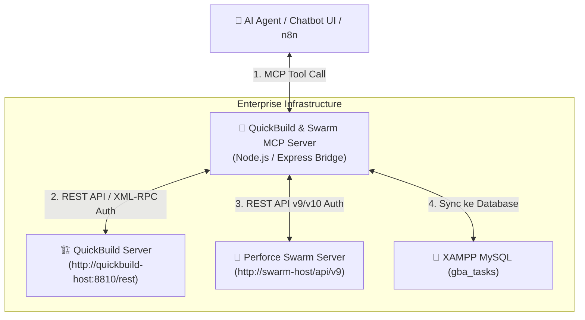

# 🚀 Panduan Custom MCP Server: Integrasi QuickBuild & Perforce Swarm

Dokumen ini berisi panduan lengkap & skrip **Custom MCP Server** (Node.js) untuk menghubungkan AI Assistant / Chatbot / n8n langsung ke **QuickBuild (CI/CD Server)** dan **Perforce Swarm (Code Review System)**.

---

## 📐 Arsitektur Integrasi QuickBuild & Perforce Swarm



---

## 🔑 Fitur Utama yang Disediakan MCP Tool:

### 1. 🏗️ QuickBuild MCP Tools:
- **`qb_get_latest_builds`**: Mengambil daftar build terbaru (AP, CP, CSC build number, status Pass/Fail, durasi, trigger user).
- **`qb_get_build_status`**: Mengecek status spesifik build ID / model tertentu.
- **`qb_trigger_build`**: Memicu build baru secara otomatis via prompt chat AI.

### 2. 🌊 Perforce Swarm MCP Tools:
- **`swarm_list_reviews`**: Mengambil daftar Code Review aktif (Review ID, Author, Reviewer, Status Approved/Needs Review).
- **`swarm_get_change_details`**: Mengambil detail Changelist Perforce (CL ID, deskripsi komit, daftar file yang diubah).

---

## 💻 Production-Ready Code: `qb-swarm-mcp-server.js`

Berikut adalah skrip lengkap MCP Server yang siap pakai:

```javascript
import { Server } from "@modelcontextprotocol/sdk/server/index.js";
import { StdioServerTransport } from "@modelcontextprotocol/sdk/server/stdio.js";
import { CallToolRequestSchema, ListToolsRequestSchema } from "@modelcontextprotocol/sdk/types.js";
import axios from "axios";
import dotenv from "dotenv";

dotenv.config();

// Konfigurasi QuickBuild & Perforce Swarm
const QB_BASE_URL = process.env.QB_BASE_URL || "http://quickbuild.internal.company.com:8810/rest";
const QB_USER = process.env.QB_USER || "admin";
const QB_PASS = process.env.QB_PASS || "password";

const SWARM_BASE_URL = process.env.SWARM_BASE_URL || "http://swarm.internal.company.com/api/v10";
const SWARM_USER = process.env.SWARM_USER || "admin";
const SWARM_API_TOKEN = process.env.SWARM_API_TOKEN || "your-swarm-api-token";

// Axios Client dengan Authentication
const qbClient = axios.create({
  baseURL: QB_BASE_URL,
  auth: { username: QB_USER, password: QB_PASS },
  headers: { "Accept": "application/json" }
});

const swarmClient = axios.create({
  baseURL: SWARM_BASE_URL,
  auth: { username: SWARM_USER, password: SWARM_API_TOKEN },
  headers: { "Accept": "application/json" }
});

// Inisialisasi MCP Server
const server = new Server(
  { name: "quickbuild-swarm-mcp", version: "1.0.0" },
  { capabilities: { tools: {} } }
);

// 1. Registrasi Tools
server.setRequestHandler(ListToolsRequestSchema, async () => {
  return {
    tools: [
      {
        name: "qb_get_latest_builds",
        description: "Mengambil daftar build project terbaru dari QuickBuild CI/CD Server",
        inputSchema: {
          type: "object",
          properties: {
            configuration_id: { type: "string", description: "ID atau Path Konfigurasi QuickBuild (opsional)" },
            limit: { type: "number", description: "Jumlah build yang ingin diambil (default: 5)" }
          }
        }
      },
      {
        name: "qb_get_build_status",
        description: "Mengecek detail dan status build tertentu di QuickBuild berdasarkan Build ID",
        inputSchema: {
          type: "object",
          properties: {
            build_id: { type: "string", description: "ID Build di QuickBuild" }
          },
          required: ["build_id"]
        }
      },
      {
        name: "swarm_list_reviews",
        description: "Mengambil daftar Code Review aktif dari Perforce Swarm",
        inputSchema: {
          type: "object",
          properties: {
            state: { type: "string", description: "Status review (needsReview, approved, archived, rejected)" },
            author: { type: "string", description: "Filter username pembuat review" },
            limit: { type: "number", description: "Limit data review (default 10)" }
          }
        }
      },
      {
        name: "swarm_get_change_details",
        description: "Mengambil detail Changelist (CL) dari Perforce Swarm berdasarkan Change ID",
        inputSchema: {
          type: "object",
          properties: {
            change_id: { type: "string", description: "ID Changelist Perforce (misal: 123456)" }
          },
          required: ["change_id"]
        }
      }
    ]
  };
});

// 2. Eksekusi Tools
server.setRequestHandler(CallToolRequestSchema, async (request) => {
  const { name, arguments: args } = request.params;

  try {
    // --- QUICKBUILD TOOLS ---
    if (name === "qb_get_latest_builds") {
      const limit = args.limit || 5;
      // Memanggil QuickBuild REST API /builds
      const res = await qbClient.get(`/builds?count=${limit}`);
      return {
        content: [{ type: "text", text: JSON.stringify(res.data, null, 2) }]
      };
    }

    if (name === "qb_get_build_status") {
      const res = await qbClient.get(`/builds/${args.build_id}`);
      return {
        content: [{ type: "text", text: JSON.stringify(res.data, null, 2) }]
      };
    }

    // --- PERFORCE SWARM TOOLS ---
    if (name === "swarm_list_reviews") {
      const params = { max: args.limit || 10 };
      if (args.state) params.state = [args.state];
      if (args.author) params.author = [args.author];

      const res = await swarmClient.get("/reviews", { params });
      return {
        content: [{ type: "text", text: JSON.stringify(res.data, null, 2) }]
      };
    }

    if (name === "swarm_get_change_details") {
      const res = await swarmClient.get(`/changes/${args.change_id}`);
      return {
        content: [{ type: "text", text: JSON.stringify(res.data, null, 2) }]
      };
    }

    throw new Error(`Tool ${name} tidak dikenali`);
  } catch (error) {
    const errorMsg = error.response ? JSON.stringify(error.response.data) : error.message;
    return {
      isError: true,
      content: [{ type: "text", text: `Gagal mengeksekusi ${name}: ${errorMsg}` }]
    };
  }
});

// 3. Start Stdio Server
const transport = new StdioServerTransport();
await server.connect(transport);
console.error("QuickBuild & Swarm MCP Server Aktif!");
```

---

## ⚙️ Cara Mengintegrasikannya dengan Aplikasi Project Manager Anda:

1. **Simpan skrip di folder project**:
   `C:\xampp\htdocs\project_manager\mcp-server\qb-swarm-mcp-server.js`
2. **Tambahkan variabel lingkungan di `mcp-server\.env`**:
   ```env
   QB_BASE_URL=http://quickbuild.company.com:8810/rest
   QB_USER=your_qb_username
   QB_PASS=your_qb_password

   SWARM_BASE_URL=http://swarm.company.com/api/v10
   SWARM_USER=your_swarm_username
   SWARM_API_TOKEN=your_swarm_token
   ```
3. **Hasil yang Didapatkan**:
   * AI Assistant di Chatbot UI dapat secara otomatis **mencocokkan build AP, CP, dan CSC** dari QuickBuild dengan data task di MySQL.
   * AI Assistant dapat mengecek **siapa reviewer & status approval Changelist di Perforce Swarm** saat Anda menanyakan status task! 🚀
