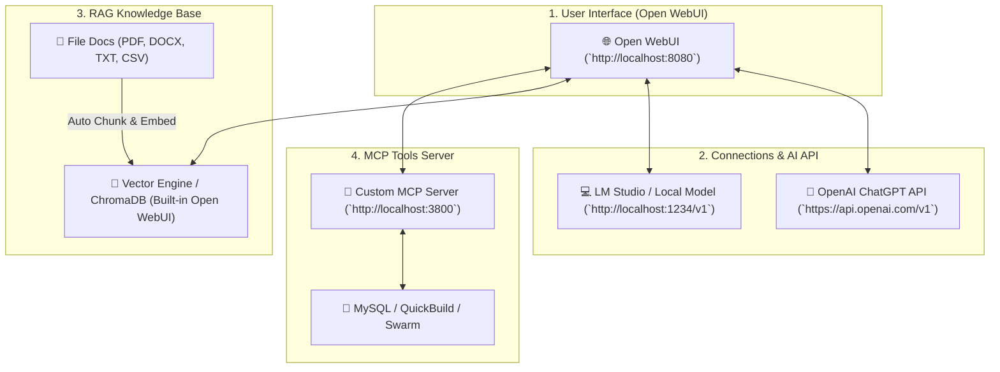

# 📚 Panduan Lengkap Setup AI API & Document RAG di Open WebUI

Dokumen ini berisi instruksi **Step-by-Step** untuk menghubungkan **AI API (OpenAI / LM Studio)** serta menyetel **Document RAG (Knowledge Base)** di Open WebUI secara native.

---

## 📐 Arsitektur RAG & AI API di Open WebUI

---

## 🛠️ Langkah 1: Hubungkan AI API ke Open WebUI

1. Buka Open WebUI di browser: `http://localhost:8080` (atau `http://localhost:3000`).
2. Login sebagai Admin, lalu buka **Admin Panel** ➔ **Settings** ➔ **Connections**.
3. Di bagian **OpenAI API**:
   * **Base URL**: `https://api.openai.com/v1` *(atau `http://localhost:1234/v1` jika menggunakan LM Studio)*.
   * **API Key**: Masukkan OpenAI API Key Anda (`sk-proj-xxxx...`).
4. Klik ikon **Refresh / Save**.
5. Di bagian atas layar Open WebUI, klik dropdown pilihan model dan pilih model seperti `gpt-4o-mini`, `gpt-4o`, atau `local-model`.

---

## 📚 Langkah 2: Setup Document RAG di Open WebUI

Open WebUI menyediakan **2 Metode RAG** yang sangat mudah:

### 🔹 Metode A: Upload Dokumen Langsung di Chat (Quick RAG)
Cocok untuk membaca dokumen sekali pakai saat berdiskusi.

1. Buka room chat baru.
2. Klik tombol **`+` (Plus Attachment)** di sebelah kiri kolom input pesan.
3. Upload file PDF, DOCX, TXT, CSV, atau Markdown Anda.
4. Tanyakan pertanyaan, misal: *"Rangkum poin utama dari dokumen ini"*.
5. Open WebUI akan otomatis memotong (*chunking*), membuat *embedding*, dan menjawab pertanyaan berdasarkan isi file tersebut.

---

### 🔹 Metode B: Membuat Knowledge Base Terpusat (Enterprise RAG Collection)
Cocok untuk dokumen standar seperti **SOP Perusahaan, Manual Spesifikasi Build, atau Knowledge Base Tim**.

1. Di menu sidebar kiri Open WebUI, klik **Workspace** ➔ **Knowledge**.
2. Klik tombol **`+ Create Knowledge Base`** di pojok kanan atas.
3. Masukkan **Title** & **Description** (misal: `SOP Testing & Build 2026`).
4. **Drag & Drop** seluruh file PDF, DOCX, TXT yang ingin dijadikan referensi.
5. Open WebUI akan meng-ingest seluruh dokumen ke dalam Vector Database terpusat.
6. **Cara Menggunakan Knowledge Base saat Chat**:
   * Ketik simbol `#` di kolom chat, lalu pilih nama Knowledge Base Anda (contoh: `#SOP Testing & Build 2026`).
   * AI secara otomatis akan menggunakan dokumen tersebut sebagai referensi RAG utama! 🚀

---

## ⚙️ Langkah 3: Konfigurasi Embedding Engine RAG di Open WebUI

Untuk hasil pencarian dokumen RAG yang paling presisi:

1. Buka **Settings** ➔ **RAG** di Open WebUI.
2. **Embedding Engine**:
   * Pilih `OpenAI` dengan model `text-embedding-3-small` *(Sangat cepat & akurat)*.
   * Atau pilih `Ollama` / `Sentence-Transformers` (`bge-m3` / `all-minilm-l6-v2`) jika ingin 100% offline.
3. **RAG Parameters**:
   * `Top K`: `3` hingga `5` (Jumlah potongan paragraf paling relevan yang diambil).
   * `Chunk Size`: `1000`.
   * `Chunk Overlap`: `100`.

---

## 🔌 Langkah 4: Hubungkan Custom MCP Server ke Open WebUI (Tools)

Agar AI di Open WebUI tidak hanya membaca dokumen RAG, tetapi juga bisa mengakses **MySQL, QuickBuild, dan Swarm**:

1. Buka **Workspace** ➔ **Tools** di Open WebUI.
2. Klik **`+ Create Tool`**.
3. Daftarkan HTTP REST Endpoint dari MCP Server kita:
   `http://localhost:3800/api/mcp/chat`
4. Aktifkan Tool tersebut di room chat.

Sekarang AI Anda di Open WebUI dapat **membaca dokumen RAG sekaligus mengecek data real-time ke MySQL & QuickBuild** secara bersamaan! 🎉
