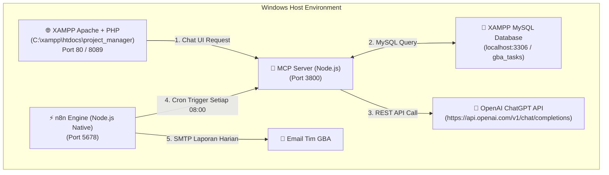

# 💻 Panduan Lengkap Implementation System di Windows (XAMPP + AI API + n8n Node.js)

Dokumen ini berisi instruksi **Step-by-Step** untuk mendeploy seluruh ekosistem **PHP Project Manager**, **MCP Server**, **AI API (OpenAI ChatGPT API / LM Studio)**, dan **n8n Automation Engine** secara **Native di Windows (Tanpa Docker)**.

---

## 📐 Arsitektur Sistem Windows (Native & Fast)



---

## ⚙️ Prasyarat Sistem Windows

1. **Windows 10 / 11 (64-bit)**
2. **XAMPP for Windows** (Apache + MySQL aktif di XAMPP Control Panel)
3. **Node.js (v18.x atau v20.x)** untuk Windows (download installer dari [nodejs.org](https://nodejs.org))
4. **OpenAI API Key** (opsional jika menggunakan ChatGPT API) atau **LM Studio for Windows**

---

## 🚀 Langkah Implementation Step-by-Step

### Langkah 1: Setup Web App & Database di XAMPP Windows

1. Copy folder project ke direktori `htdocs` XAMPP:
   ```text
   C:\xampp\htdocs\project_manager\
   ```
2. Buka XAMPP Control Panel, pastikan service **Apache** dan **MySQL** berstatus **Running**.
3. Buka browser: `http://localhost/phpmyadmin`
4. Buat database baru `project_manager_db` (atau `gba_db`) dan import file SQL schema.
5. Akses aplikasi web di browser: `http://localhost/project_manager`

---

### Langkah 2: Setup & Jalankan MCP Server di Windows

1. Buka **Command Prompt (CMD)** atau **PowerShell**:
   ```cmd
   cd C:\xampp\htdocs\project_manager\mcp-server
   npm install
   ```
2. Salin template `.env`:
   ```cmd
   copy .env.example .env
   ```
3. Edit file `mcp-server\.env` menggunakan Notepad / VS Code:
   ```env
   MCP_HTTP_PORT=3800
   DB_HOST=127.0.0.1
   DB_PORT=3306
   DB_USER=root
   DB_PASS=
   DB_NAME=project_manager_db

   # Pilih Provider AI (OpenAI ChatGPT API atau LM Studio)
   OPENAI_API_KEY=sk-proj-xxxxxx...
   OPENAI_MODEL=gpt-4o-mini

   # Jika menggunakan LM Studio Lokal di Windows:
   LMSTUDIO_BASE_URL=http://localhost:1234/v1
   LMSTUDIO_MODEL=local-model
   ```
4. Jalankan MCP Server HTTP Bridge:
   ```cmd
   node index.js
   ```
   *(Server aktif mendengarkan di `http://localhost:3800`)*.

---

### Langkah 3: Setup & Jalankan n8n Native Node.js di Windows (Tanpa Docker)

1. Buka jendela **Command Prompt (CMD) baru**:
   ```cmd
   npm install n8n -g
   ```
2. Jalankan service n8n:
   ```cmd
   n8n start
   ```
   *(n8n akan berjalan secara native di `http://localhost:5678`)*.
3. Buka browser ke `http://localhost:5678`:
   * Pilih menu **Workflows** ➔ **Import from File**.
   * Import file blueprint workflow JSON:
     `C:\xampp\htdocs\project_manager\mcp-server\n8n-workflows\daily_overall_status_mcp_report.json`
   * Pada node `Hermes LM Studio AI (MCP HTTP Bridge)`, pastikan URL menunjuk ke:
     `http://localhost:3800/api/mcp/chat`

---

### Langkah 4: Pengujian & Verifikasi Fitur

1. **Pengujian Chatbot AI**:
   * Buka web `http://localhost/project_manager`
   * Klik ikon Chatbot UI di pojok kanan bawah.
   * Ketik: *"bantu buatkan laporan status harian task GBA"*
   * Verifikasi AI menyapa pengguna secara personal (*"Halo [NamaUser]"*), serta merender **Tabel 7 Kolom** lengkap (`No`, `Model & Build`, `PIC`, `Test Plan`, `Status`, `Kinerja`, `Tanggal`).

2. **Pengujian Tambah Task Baru**:
   * Ketik di Chatbot: *"bantu tambahkan task baru untuk endri model SM-F966B AP: F966BXXSCBZH2 CP: F966BXXSCBZH6 CSC: F966BOXMCBZH5 testplan SMR"*
   * Verifikasi task baru **langsung tersimpan ke database MySQL XAMPP**.

3. **Pengujian Hapus Task dengan Tombol Interaktif (YES & CANCEL)**:
   * Ketik di Chatbot: *"bantu hapus task PL"*
   * Verifikasi AI menampilkan rincian task dan merender 2 tombol interaktif `[✓ Yes, Hapus Task]` & `[✕ Cancel]`.
   * Klik `[✓ Yes, Hapus Task]`, verifikasi task terhapus dan AI merender 10 task terbaru dalam **Tabel Markdown 7 Kolom**.

4. **Pengujian Laporan Otomatis SMTP Email (n8n)**:
   * Jalankan workflow n8n `Daily Overall Status Report`.
   * Cek email masuk: Laporan berukuran full-width dengan 4 KPI Scorecard (`Task Aktif`, `Test Ongoing`, `Task Baru`, `Submitted`), **2 Bar Chart Perbandingan (Task per PIC & Task per Test Plan)**, serta **Tabel Data 7 Kolom**.

---

## 🎯 Tips & Trik Pemeliharaan di Windows

1. **Menjalankan Service Otomatis saat Windows Startup**:
   * Anda bisa menggunakan PM2 for Windows untuk membuat MCP Server & n8n berjalan otomatis di background tanpa perlu membuka jendela CMD setiap kali Windows dinyalakan:
     ```cmd
     npm install pm2 -g
     pm2 start C:\xampp\htdocs\project_manager\mcp-server\index.js --name "mcp-server"
     pm2 start n8n --name "n8n"
     pm2 save
     ```
2. **Daftar Port Layanan di Windows**:
   * Port `80` / `8089`: XAMPP Apache PHP Web App
   * Port `3306`: XAMPP MySQL Database
   * Port `3800`: MCP Server HTTP Bridge
   * Port `5678`: n8n Automation Engine (Native Node.js)
   * Port `1234`: LM Studio (jika menggunakan Local AI Engine)
