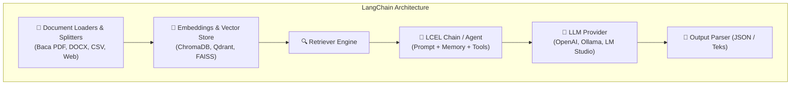

# 🦜🔗 Penjelasan Lengkap LangChain & Perbandingannya dengan MCP & RAG

Dokumen ini berisi penjelasan komprehensif mengenai **LangChain**, komponen utamanya, serta perbandingannya dengan **MCP (Model Context Protocol)** dan **Open WebUI**.

---

## 💡 Apa Itu LangChain?

**LangChain** adalah framework open-source paling populer di dunia AI yang dirancang untuk membantu developer membangun **aplikasi berbasis LLM (Large Language Model)** seperti Chatbot RAG, AI Agent, Sistem Analisis Dokumen, dan Otomasi Workflow secara terstruktur dan cepat.

Nama **LangChain** sendiri berasal dari kata:
- **Lang**: *Language Model* (seperti OpenAI GPT-4, Claude, Ollama, Llama 3, LM Studio).
- **Chain**: *Rantai Komponen* yang menghubungkan Prompt ➔ Memory ➔ RAG Vector Store ➔ Database ➔ API ➔ Output.

---

## 🧱 5 Komponen Utama LangChain



### 1. Model I/O (Wrapper LLM Universal)
Memungkinkan Anda berganti provider AI (OpenAI, Anthropic, Ollama, HuggingFace) hanya dengan mengubah 1 baris kode tanpa mengubah logika aplikasi.

### 2. RAG & Data Connection (Retrieval)
- **Document Loaders**: Membaca lebih dari 100+ format file (PDF, DOCX, HTML, Notion, YouTube transcript, dll.).
- **Text Splitters**: Memotong dokumen panjang menjadi potongan (*chunks*) yang optimal.
- **Vector Stores**: Menghubungkan ke database vektor (ChromaDB, Pinecone, Qdrant, FAISS, PGVector).

### 3. Chains (LCEL - LangChain Expression Language)
Menghubungkan berbagai langkah pemrosesan dalam bentuk alur kerja linier (pipeline), contoh:
```python
chain = prompt | llm | output_parser
```

### 4. Agents & Tools
Memberikan kemampuan kepada AI untuk **berpikir secara mandiri** dan memilih *Tool* yang tepat (misal: mencari di database MySQL, memanggil API QuickBuild, mencari berita di Google, atau memanggil MCP Server).

### 5. Memory
Mengelola konteks riwayat percakapan agar AI tidak pikun (Window Buffer Memory, Summary Memory).

---

## ⚖️ Perbandingan: LangChain vs MCP vs Open WebUI

| Kriteria | LangChain | MCP (Model Context Protocol) | Open WebUI |
| :--- | :--- | :--- | :--- |
| **Kategori** | **Framework / Library Koding** (Python & JS) | **Protokol Standar Komunikasi** AI & Data | **Antarmuka Web Application (UI)** |
| **Fungsi Utama** | Membangun RAG, Agent, & Alur Kerja AI dari NOL via kode | Menghubungkan AI ke Tools/Database eksternal secara terstandar | Platform Chatbot siap pakai ala ChatGPT dengan RAG bawaan |
| **Pengguna Utama** | AI Engineer / Developer | Developer Server & Client | End-User / Tim Perusahaan |
| **Bahasa Pemrograman** | Python / JavaScript (TypeScript) | JSON-RPC (Node.js, Python, Go) | Python (FastAPI) & SvelteKit |

---

## 💻 Contoh Kode RAG Sederhana dengan LangChain (Python)

```python
from langchain_community.document_loaders import PyPDFLoader
from langchain_text_splitters import RecursiveCharacterTextSplitter
from langchain_openai import OpenAIEmbeddings, ChatOpenAI
from langchain_community.vectorstores import Chroma
from langchain.chains import create_retrieval_chain
from langchain.chains.combine_documents import create_stuff_documents_chain
from langchain_core.prompts import ChatPromptTemplate

# 1. Load PDF Dokumen
loader = PyPDFLoader("SOP_Perusahaan.pdf")
docs = loader.load()

# 2. Potong Dokumen menjadi Chunks
text_splitter = RecursiveCharacterTextSplitter(chunk_size=1000, chunk_overlap=100)
splits = text_splitter.split_documents(docs)

# 3. Buat Vector Embeddings & Simpan ke ChromaDB
vectorstore = Chroma.from_documents(documents=splits, embedding=OpenAIEmbeddings())
retriever = vectorstore.as_retriever()

# 4. Buat Prompt & RAG Chain
prompt = ChatPromptTemplate.from_template("""
Jawab pertanyaan berdasarkan konteks berikut:
{context}

Pertanyaan: {input}
""")

llm = ChatOpenAI(model="gpt-4o-mini")
question_answer_chain = create_stuff_documents_chain(llm, prompt)
rag_chain = create_retrieval_chain(retriever, question_answer_chain)

# 5. Eksekusi Tanya Jawab RAG
response = rag_chain.invoke({"input": "Apa syarat pengujian Normal MR?"})
print("Jawaban AI:", response["answer"])
```

---

## 💡 Kapan Harus Menggunakan LangChain?

- **Gunakan LangChain** jika Anda adalah **developer** yang ingin membangun aplikasi AI RAG custom, backend microservice AI, atau agen mandiri dengan logika bisnis yang spesifik via koding Python/Node.js.
- **Gunakan Open WebUI** jika Anda menginginkan **aplikasi portal AI siap pakai** yang dapat diakses langsung oleh user di browser tanpa perlu menulis skrip RAG dari awal.
