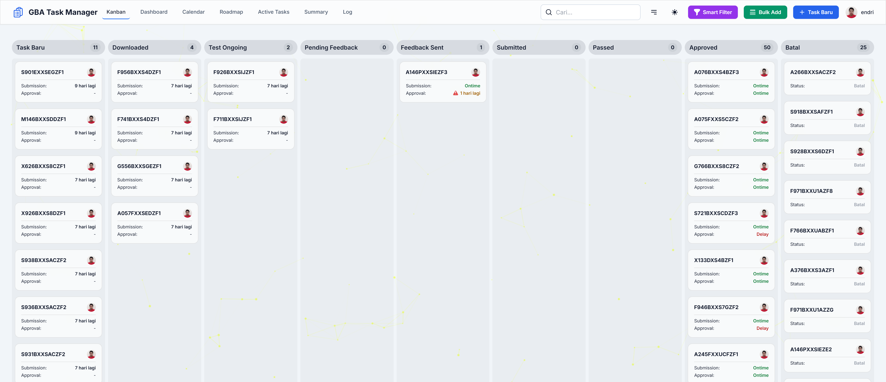
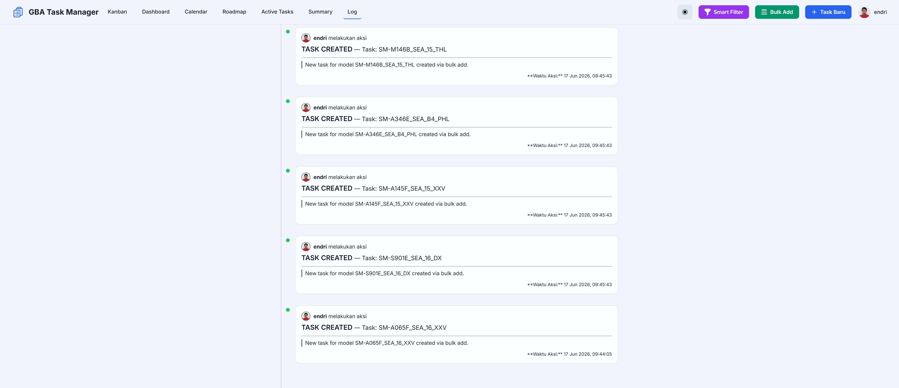
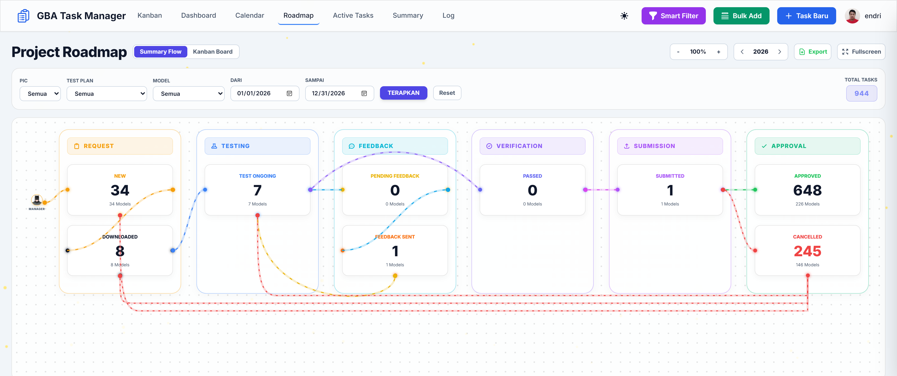

# Google Build Approval (GBA) Task Manager

 **GBA Task Manager** adalah aplikasi web berbasis PHP yang dirancang untuk mengelola dan melacak tugas-tugas yang terkait dengan proses *Google Build Approval* (GBA). Aplikasi ini menyediakan antarmuka Kanban, dasbor analitik, dan manajemen tugas terpusat untuk meningkatkan efisiensi tim.

Aplikasi ini dibangun menggunakan PHP native, MySQL, dan Tailwind CSS untuk *styling*.

## Fitur Utama ✨

* **Manajemen Tugas**:
    * Buat, edit, dan hapus tugas GBA dengan *form* yang detail.
    * Tetapkan PIC (*Person in Charge*) untuk setiap tugas.
    * Tandai tugas sebagai *urgent* untuk prioritas lebih tinggi.
* **Kanban Board**:
    * Visualisasikan alur kerja tugas dari "Task Baru" hingga "Approved".
    * Fitur *drag-and-drop* untuk mengubah status tugas dengan mudah.
    * Tampilan kartu yang informatif, menunjukkan detail penting seperti versi *build*, PIC, dan status kinerja.
* **GBA Dashboard**:
    * Dasbor analitik dengan ringkasan statistik total tugas.
    * Grafik distribusi tugas mingguan per PIC untuk memantau beban kerja.
    * Grafik aktivitas tahunan untuk melacak tren produktivitas tim.
* **Tampilan Ringkasan (*Summary*)**:
    * Tampilan tabel yang komprehensif dari semua tugas.
    * Fitur pencarian dan *filter* berdasarkan tipe *test plan*.
    * Ekspor data ke format Excel untuk kebutuhan laporan.
* **Manajemen Pengguna**:
    * Sistem registrasi dan *login* dengan *password hashing*.
    * Level akses berbasis peran (Admin dan User).
    * Admin memiliki hak akses penuh, termasuk untuk menghapus dan menambahkan tugas secara massal (*bulk add*).
* **Fitur Tambahan**:
    * Pembaruan foto profil dan *password* oleh pengguna.
    * *Mapping* otomatis dari *Model Name* ke *Marketing Name*.
    * Tampilan tema terang (*light mode*) dan gelap (*dark mode*).
## Tangkapan Layar (Screenshots) 📸

Berikut adalah beberapa tampilan utama dari aplikasi **GBA Task Manager**:

### 1. Dasbor & Papan Kanban (Halaman Utama)


### 2. Log Aktivitas (Activity Log)


### 3. Peta Jalan Proyek (Project Roadmap)


### 4. Peta Jalan Proyek - Tampilan Alternatif / Detail


## Teknologi yang Digunakan 🛠️

* **Backend**: PHP 8.2+
* **Frontend**: HTML, Tailwind CSS, JavaScript (Native)
* **Database**: MySQL / MariaDB
* **Library**:
    * [Chart.js](https://www.chartjs.org/) untuk visualisasi data.
    * [SortableJS](https://sortablejs.github.io/Sortable/) untuk fungsionalitas *drag-and-drop* pada Kanban.
    * [Quill.js](https://quilljs.com/) sebagai *rich text editor*.

## Panduan Instalasi 🚀

1.  **Prasyarat**:
    * Web server (contoh: Apache)
    * PHP versi 8.2 atau lebih baru
    * Database MySQL atau MariaDB

2.  **Clone Repositori**:
    ```bash
    git clone [https://github.com/your-username/your-repository.git](https://github.com/your-username/your-repository.git)
    cd your-repository
    ```

3.  **Konfigurasi Database**:
    * Impor *file* `project_manager_db.sql` ke dalam database MySQL Anda.
    * Salin atau ganti nama *file* `config.php`.
    * Sesuaikan kredensial database (`DB_SERVER`, `DB_USERNAME`, `DB_PASSWORD`, `DB_NAME`) di dalam *file* `config.php` agar sesuai dengan konfigurasi server lokal Anda.

4.  **Folder `uploads`**:
    * Pastikan *folder* `uploads` ada di direktori utama proyek.
    * Berikan izin tulis (*write permission*) pada *folder* `uploads` agar pengguna dapat mengunggah foto profil.

5.  **Jalankan Aplikasi**:
    * Letakkan direktori proyek di dalam *root* *web server* Anda (misalnya `htdocs` untuk XAMPP).
    * Buka *browser* dan akses aplikasi melalui `http://localhost/nama-folder-proyek/`.
    * Halaman pertama yang akan muncul adalah halaman *login*. Anda bisa mendaftar sebagai admin atau *user* baru.

## Struktur Direktori 📂
